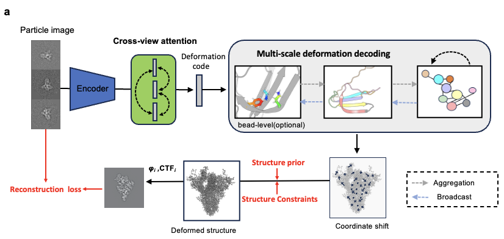
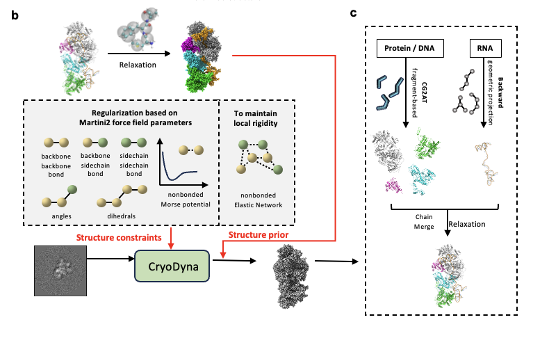

## CryoDyna: Multiscale end-to-end modeling of cryo-EM macromolecule dynamics with physics-aware neural network
[📚 User Guide](https://stu-pku-edu-cn.gitbook.io/cryodyna/)

## User Guide
The detailed user guide can be found at [here](https://stu-pku-edu-cn.gitbook.io/cryodyna/). This comprehensive guide provides in-depth information about the topic at hand. Feel free to visit the link if you're seeking more knowledge or need extensive instructions regarding the topic. 

## Installation

- Create a conda environment: 
```bash
conda create -n cryodyna python=3.9 -y 
conda activate cryodyna
```
- Clone this repository and install the package: 
```bash
git clone https://github.com/Qmi3/Cryodyna.git
cd Cryodyna 
pip install -r requirements.txt
pip install -e .
```

## Quick start

### Preliminary

You may need to prepare the resources below before running `CryoDyna`:

- **Consensus map** together with the pose parameters of each particle.
- **PDB structure** docked into the consensus map.

**PDB requirements**
- The structure may contain **proteins and nucleic acids only**.
- Protein residues must belong to the **20 canonical amino acids**.
- **Non-standard residues, ligands, and other hetero atoms are currently not supported.**

### Example Dataset

We use a simulated dataset of the **one-dimensional conformational transition of *Escherichia coli* adenylate kinase** between its closed state (PDB: 1AKE) and open state (PDB: 4AKE) as an example.

Download the dataset:

```bash
wget https://zenodo.org/records/17581921/files/tutorial_data_1ake.zip
```
and extract the zip file to the path `./projects/star`:
```bash
mkdir ./projects/star
unzip tutorial_data_1ake.zip -d ./projects/star
```

### Training
CryoDyna predicts conformational heterogeneity in two distinct level (residue-level and bead-level). Here's an illustration of its process:

#### Stage1 Training the residue-level deformation field
<p align="center">
  
</p>

In this step, we generate an ensemble of molecule structures from the particles with Ca/P atom representing each residue. Note that the `pdb` file is used in this step and it should be docked into the concensus map!

```shell
cd projects
python train_atom.py atom_configs/1ake.py
```

The outputs will be stored in the `1ake/atom_xxxxx` directory. Within this directory, you'll observe sub-directories with the name `epoch-number_step-number`. We choose the most recent directory as the final results.

```text
atom_xxxxx/
├── 0000_0000000/
├── ...
├── 0112_0096000/        # evaluation results
│  ├── ckpt.pt           # model parameters
│  ├── input_image.png   # visualization of input cryo-EM images
│  ├── pca-1.pdb         # sampled coarse-grained atomic structures along 1st PCA axis
│  ├── pca-2.pdb
│  ├── pca-3.pdb
│  ├── pred.pdb          # sampled structures at Kmeans cluster centers
│  ├── pred_gmm_image.png
│  └── z.npy             # the latent code of each particle
|                        # a matrix whose shape is num_of_particle x 8
├── yyyymmdd_hhmmss.log  # running logs
├── config.py            # a backup of the config file
└── train_atom.py        # a backup of the training script
```

#### Stage2: Training the bead-level deformation field
<p align="center">
  
</p>

In this step, we generate an ensemble of molecule structures from the particles with 1-6 beads representing each residue.


During the training of CryoDyna-CG, the model requires a MARTINI2 coarse-grained structural prior.
You may directly provide an all-atom structure, and CryoDyna-CG will automatically perform the coarse-graining.

**(Optionally)**, you may provide a MARTINI-coarse-grained structure that has already been energy-minimized, which can help the structural regularization converge more quickly during the early training stage. Using 1ake as an example:
First, run ``` ./martinize_struct_prior.sh ``` in a Python 2 environment to generate the coarse-grained mapping from the all-atom structure.
Then, run ```./minimize_struct_prior.sh``` to perform energy minimization (this step requires that the user has GROMACS installed).

After that, run

```shell
cd projects
python train_cg.py cg_configs/1ake.py
```

The outputs will be stored in the `1ake_cg/atom_xxxxx` directory, and we perform evaluations every 12,000 steps. Within this directory, you'll observe sub-directories with the name `epoch-number_step-number`. We choose the most recent directory as the final results.

```text
atom_xxxxx/
├── 0000_0000000/
├── ...
├── 0112_0096000/        # evaluation results
│  ├── ckpt.pt           # model parameters
│  ├── input_image.png   # visualization of input cryo-EM images
│  ├── pca-1.pdb         # sampled coarse-grained atomic structures along 1st PCA axis
│  ├── pca-2.pdb
│  ├── pca-3.pdb
│  ├── pred.pdb          # sampled structures at Kmeans cluster centers
│  ├── pred_gmm_image.png
│  └── z.npy             # the latent code of each particle
|                        # a matrix whose shape is num_of_particle x 8
├── yyyymmdd_hhmmss.log  # running logs
├── config.py            # a backup of the config file
└── train_atom.py        # a backup of the training script
```

After generating the bead-level structure, you may use a backmapping method to obtain the full-atom structure.
In our work, we use [CG2AT2 + Backward](https://github.com/PepperLee-sm/CG2AT2-Backward.git) for the backmapping procedure.

### Backmapping Example

As an example, we perform backmapping for the **PC1 trajectory at epoch 3**.

First, split the 10 structures contained in `pca-1.pdb` into individual `.pdb` files by running:
```bash
python split_pdb.py 1ake_cg/atom_1ake/0003_0003124/pca-1.pdb
```
The resulting single-structure .pdb files will be saved in `1ake_cg/atom_1ake/0003_0003124/pca-1`

Next, assuming that CG2AT2_Backward has already been properly configured, run `./backmapping_dir.sh` to perform the backmapping. This step converts the coarse-grained structures along the PC1 trajectory into atomistic structures.

```text
atom_xxxxx/
├── 0000_0000000/
├── ...
├── 0003_0003124/        # evaluation results
│  ├── pca-1           
│  │  │── 1          
│  │  │── 2  
│  │  │  │── FINAL
│  │  │  │  │── final_cg2at_de_novo_fixed.pdb # All-atom structure for the 2nd frame of the PC1 trajectory
│  │  │  │── INPUT
│  │  │  │── MERGED
│  │  │  │── PROTEIN
│  │  │── ...
│  │  │── 10         
│  ├── ...
│  ├── pca-1.pdb         # sampled coarse-grained atomic structures along 1st PCA axis
cluster centers
│  ├── ...
```

### Validation: Training the density generator

In step 1/2, the atom generator assigns a latent code `z` to each particle image. In this step, we will drop the encoder and directly use the latent code as a representation of a partcile. You can execute the subsequent command to initiate the training of a density generator.

```shell
# change the xxx/z.npy path to the output of the above command
python train_density.py density_configs/1ake.py --cfg-options extra_input_data_attr.given_z=xxx/z.npy
```

Results will be saved to `work_dirs/density_xxxxx`, and each subdirectory has the name `epoch-number_step-number`. We choose the most recent directory as the final results.

```text
density_xxxxx/
├── 0004_0014470/          # evaluation results
│  ├── ckpt.pt             # model parameters
│  ├── vol_pca_1_000.mrc   # density sampled along the PCA axis, named by vol_pca_pca-axis_serial-number.mrc
│  ├── ...
│  ├── vol_pca_3_009.mrc
│  ├── z.npy
│  ├── z_pca_1.txt         # sampled z values along the 1st PCA axis
│  ├── z_pca_2.txt
│  └── z_pca_3.txt
├── yyyymmdd_hhmmss.log    # running logs
├── config.py              # a backup of the config file
└── train_density.py       # a backup of the training script
```


## Reference
You may cite this software by:
```bibtex
@misc{zhang2025cryodynamultiscaleendtoendmodeling,
      title={CryoDyna: Multiscale end-to-end modeling of cryo-EM macromolecule dynamics with physics-aware neural network}, 
      author={Chengwei Zhang and Shimian Li and Yihao Niu and Zhen Zhu and Sihao Yuan and Sirui Liu and Yi Qin Gao},
      year={2025},
      eprint={2510.16510},
      archivePrefix={arXiv},
      primaryClass={q-bio.BM},
      url={https://arxiv.org/abs/2510.16510}, 
}
```
